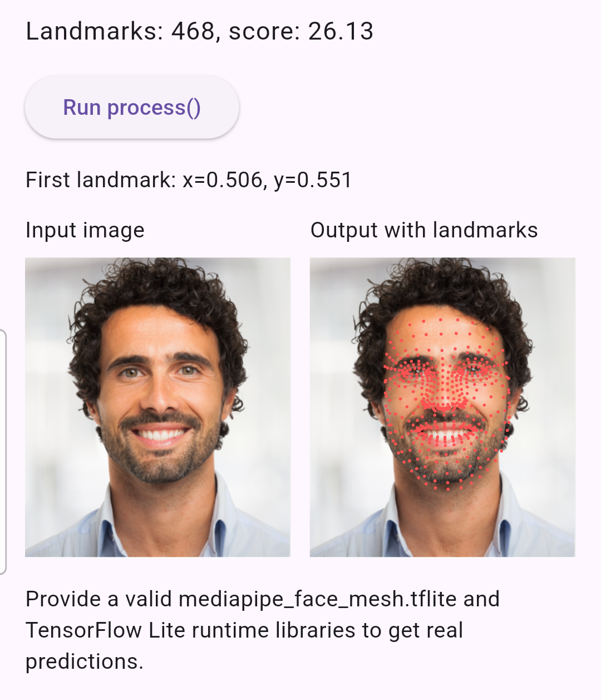
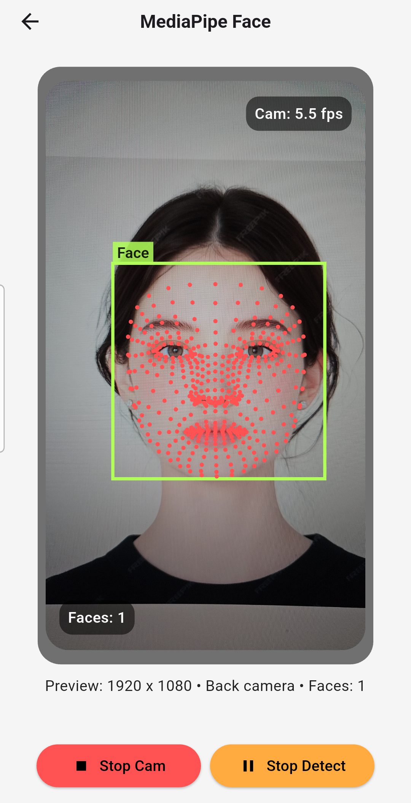

# mediapipe_face_mesh

Flutter/FFI bindings for the MediaPipe Face Mesh graph with optional XNNPACK/GPU delegates.  
The plugin bundles the native binaries and a default model, so no extra setup is required.  
Exposes a simple API for running single snapshots or continuous camera streams.  

- TensorFlow Lite C runtime loaded dynamically, with optional XNNPACK or GPU (V2) delegates.
- Supports RGBA/BGRA buffers and Android NV21 camera frames.
- ROI helpers (`FaceMeshBox`, `NormalizedRect`) to limit processing to face regions.
- Stream processor utilities to consume frames sequentially and deliver `FaceMeshResult` updates.

Note: Face detection is not included.  
If you need dynamic ROIs, use a face detector (e.g. [google_mlkit_face_detection](https://pub.dev/packages/google_mlkit_face_detection)) before calling this package.

## Install

```bash
flutter pub add mediapipe_face_mesh
```

## Usage

two ways to use it:
1) provide one frame at a time (Single Frame Inference)
2) provide a stream of frames (Frame Stream Inference)

Both approaches run the same per-frame computation. The only difference is who drives the frame flow: you push each frame manually, or you hand off a stream and receive results as they are emitted.

### Create
```
import 'package:mediapipe_face_mesh/mediapipe_face_mesh.dart';

final faceMeshProcessor = await FaceMeshProcessor.create(
  delegate: FaceMeshDelegate.xnnpack, // FaceMeshDelegate.cpu is default
);
```

### Single Frame Inference
```
      if (Platform.isAndroid) {
        ...
        final nv21 = _buildNv21Image(cameraImage: cameraImage);
        final adjustedSize = _adjustedImageSize(
          Size(cameraImage.width.toDouble(), cameraImage.height.toDouble()),
          inputImageRotation,
        );
        final bbox = face.boundingBox;
        final clamped = Rect.fromLTRB(
          bbox.left.clamp(0.0, adjustedSize.width),
          bbox.top.clamp(0.0, adjustedSize.height),
          bbox.right.clamp(0.0, adjustedSize.width),
          bbox.bottom.clamp(0.0, adjustedSize.height),
        );
    
        final FaceMeshBox box = FaceMeshBox.fromLTWH(
          left: clamped.left,
          top: clamped.top,
          width: clamped.width,
          height: clamped.height,
        );            
        
        result = _faceMeshProcessor.processNv21(
          nv21,
          box: box,
          boxScale: 1.2,
          boxMakeSquare: true,
          rotationDegrees: rotationCompensation,
        );
      } else if (Platform.isIOS) {
        ...
        final image = _buildBgraImage(cameraImage: cameraImage);
        final adjustedSize = _adjustedImageSize(
        Size(cameraImage.width.toDouble(), cameraImage.height.toDouble()),
          inputImageRotation,
        );
        final bbox = face.boundingBox;
        final clamped = Rect.fromLTRB(
          bbox.left.clamp(0.0, adjustedSize.width),
          bbox.top.clamp(0.0, adjustedSize.height),
          bbox.right.clamp(0.0, adjustedSize.width),
          bbox.bottom.clamp(0.0, adjustedSize.height),
        );
        final FaceMeshBox box = FaceMeshBox.fromLTWH(
          left: clamped.left,
          top: clamped.top,
          width: clamped.width,
          height: clamped.height,
        );
        
        result = _faceMeshProcessor.process(
          image,
          box: box,
          boxScale: 1.2,
          boxMakeSquare: true,
          rotationDegrees: rotationCompensation,
        );
      }
```

### Frame Stream Inference
The stream approach also uses the `FaceMeshProcessor` object.
```
    _faceMeshStreamProcessor = FaceMeshStreamProcessor(_faceMeshProcessor);
    ...
    if (Platform.isAndroid) {
      _nv21StreamController = StreamController<FaceMeshNv21Image>();
      _meshStreamSubscription = _faceMeshStreamProcessor
          .processNv21(
            _nv21StreamController!.stream,
            boxResolver: _resolveFaceMeshBoxForNv21,
            boxScale: 1.2,
            boxMakeSquare: true,        
            rotationDegrees: rotationDegrees,
          )
          .listen(_handleMeshResult, onError: _handleMeshError);
    } else if (Platform.isIOS) {
      _bgraStreamController = StreamController<FaceMeshImage>();
      _meshStreamSubscription = _faceMeshStreamProcessor
          .process(
            _bgraStreamController!.stream,
            boxResolver: _resolveFaceMeshBoxForBgra,
            boxScale: 1.2,
            boxMakeSquare: true,
            rotationDegrees: rotationDegrees,
          )
          .listen(_handleMeshResult, onError: _handleMeshError);
    }
```

## Example

The __[example included in this package](https://github.com/cornpip/mediapipe_face_mesh/tree/master/example)__ loads assets img and converts it to an RGBA buffer,
runs a single-frame inference, and draws the resulting landmarks.



For a camera-based example, see __https://github.com/cornpip/flutter_vision_ai_demos.__  
It streams live camera frames, obtains face bounding boxes using
`google_mlkit_face_detection`, and passes them to `mediapipe_face_mesh`
for landmark inference.



## Reference

### Model asset

The plugin ships with `assets/models/mediapipe_face_mesh.tflite`, taken from the Face Landmark model listed in Google’s official collection: https://github.com/google-ai-edge/mediapipe/blob/master/docs/solutions/models.md.

### Building the TFLite C API binaries
- Android: [official LiteRT android build guide](https://ai.google.dev/edge/litert/build/android?_gl=1*ut97f0*_up*MQ..*_ga*MTY5OTc2NjM3Mi4xNzY1NzA2NTkz*_ga_P1DBVKWT6V*czE3NjU3MDY1OTMkbzEkZzAkdDE3NjU3MDY1OTMkajYwJGwwJGgzNDMwOTIyOTM)
- iOS: [official LiteRT ios build guide](https://ai.google.dev/edge/litert/build/ios?_gl=1*1d2hrp5*_up*MQ..*_ga*MTIzNzU5NTgzMy4xNzY2OTQxNzc3*_ga_P1DBVKWT6V*czE3NjY5NDE3NzYkbzEkZzAkdDE3NjY5NDE3NzYkajYwJGwwJGg5MjIwMDQxODc.)

Build outputs expected by this plugin:
- Android shared libraries under `android/src/main/jniLibs/arm64-v8a` and `android/src/main/jniLibs/x86_64`.
- iOS framework bundle at `ios/Frameworks/TensorFlowLiteC.framework`.

### TFLite C API headers
The `src/include/tensorflow` directories are copied from the official TensorFlow repository: https://github.com/tensorflow/tensorflow/tree/master/tensorflow.

## Detail

### FaceMeshProcessor.create parameter

```
final faceMeshProcessor = await FaceMeshProcessor.create(
  delegate: FaceMeshDelegate.xnnpack // FaceMeshDelegate.cpu is default
);
```

- `threads`: number of CPU threads used by TensorFlow Lite. Increase it to speed
  up inference on multi-core devices, keeping thermal/power trade-offs in mind. (default 2)
- `delegate`: choose between CPU, XNNPACK, or GPU (V2) delegates. Default is `FaceMeshDelegate.cpu`.
- `minDetectionConfidence`: threshold for the initial face detector. Lowering it
  reduces missed detections but may increase false positives (default 0.5).
- `minTrackingConfidence`: threshold for keeping an existing face track alive.
  Higher values make tracking stricter but can drop faces sooner (default 0.5).
- `enableSmoothing`: toggles MediaPipe's temporal smoothing between frames.
  Keeping it `true` (default) reduces jitter but adds inertia; set `false` for
  per-frame responsiveness when you don't reuse tracking context.
- `enableRoiTracking`: enables internal ROI tracking between frames. When set
  to `false`, calls that omit `roi`/`box` always run full-frame inference.

Always remember to call `close()` on the processor when you are done.

### _faceMeshProcessor.process parameter

```
result = _faceMeshProcessor.process(
  image,
  box: box,
  boxScale: 1.2,
  boxMakeSquare: true,
  rotationDegrees: rotationCompensation,
);
```
- `image`: `FaceMeshImage` containing an RGBA/BGRA pixel buffer. The processor
  copies the data into native memory, so the underlying bytes can be reused
  immediately after the call returns.
- `roi`: optional `NormalizedRect` that describes the region of interest
  in normalized 0..1 coordinates (MediaPipe layout: `xCenter`, `yCenter`,
  `width`, `height`, `rotation`). Use this when you precompute ROIs yourself,
  and No extra clamping, scaling, or squaring is performed inside the plugin. Cannot be combined with `box`.
- `box`: optional `FaceMeshBox` in pixel space. When provided, it is converted
  internally into a normalized rect, clamped to the image bounds, optionally
  squarified, and then scaled by `boxScale`. Helps limit work to the detected
  face instead of the entire frame.
- `boxScale`: multiplicative expansion/shrink factor applied to the ROI derived
  from `box`. Values >1.0 pad the box (default 1.2 via `_boxScale`). Must be
  positive.
- `boxMakeSquare`: when `true`, the converted ROI uses the max-side length for
  both width and height so the downstream Face Mesh graph gets a square crop.
  Set `false` to retain the original aspect ratio of the box.
- `rotationDegrees`: informs the native graph about the orientation of the
  provided pixels. Only 0/90/180/270 are allowed; logical width/height swap
  automatically, so ROIs remain aligned with upright faces.
- `mirrorHorizontal`: mirrors the input crop horizontally before inference so
  the returned landmarks already align with mirrored front-camera
  previews.

If both `roi` and `box` are omitted, the processor uses its internal ROI
tracking state (or the full frame if `enableRoiTracking` is disabled). Passing
both results in an `ArgumentError`. 

The same parameter rules apply to `processNv21`, using the NV21 image wrapper
instead of an RGBA/BGRA buffer.

### _faceMeshStreamProcessor.process parameter

```
_meshStreamSubscription = _faceMeshStreamProcessor
  .process(
    _bgraStreamController!.stream,
    boxResolver: _resolveFaceMeshBoxForBgra,
    boxScale: 1.2,
    boxMakeSquare: true,
    rotationDegrees: rotationDegrees,
  )
  .listen(_handleMeshResult, onError: _handleMeshError);
```

- `frames`: `Stream<FaceMeshImage>` source. Each frame is awaited sequentially
  before being passed to `_faceMeshProcessor.process`.
- `roi`: matches the `_faceMeshProcessor.process` semantics (a precomputed
  normalized rectangle) and cannot be combined with `boxResolver`.
- `boxResolver`: optional callback that returns a `FaceMeshBox` per frame, 
  which is then processed through the same clamp/scale/square pipeline used by `_faceMeshProcessor.process`.

`_faceMeshStreamProcessor.process()` internally invokes `_faceMeshProcessor.process`
for every frame, so the ROI/box/rotation/mirroring options behave identically. The
only difference is that it consumes an incoming `Stream<FaceMeshImage>` and forwards
each awaited frame with the parameters you provide (or the per-frame `boxResolver`).

`.processNv21` follows the same flow, but operates on `Stream<FaceMeshNv21Image>` sources 
and forwards them to `_faceMeshProcessor.processNv21`.

### Output (FaceMeshResult)

```
class FaceMeshResult {
  ...
  /// All face landmarks returned by the native graph.
  final List<FaceMeshLandmark> landmarks;

  /// Triangles describing the mesh topology.
  final List<MpFaceMeshTriangle> triangles;

  /// Normalized rectangle covering the detected face.
  final NormalizedRect rect;

  /// Confidence score reported by MediaPipe.
  final double score;

  /// Width of the image used during inference.
  final int imageWidth;

  /// Height of the image used during inference.
  final int imageHeight;
}

/// A single 3D landmark returned by MediaPipe.
class FaceMeshLandmark {
  ...
  /// Horizontal coordinate normalized to [0, 1].
  final double x;

  /// Vertical coordinate normalized to [0, 1].
  final double y;

  /// Depth relative to the camera in canonical MediaPipe units.
  final double z;
}

/// Triangle made up of 3 face mesh landmarks.
class MpFaceMeshTriangle {
  ...
  /// Indices into the full landmark list (length 3).
  final List<int> indices;

  /// Landmark points referenced by [indices] (length 3).
  final List<FaceMeshLandmark> points;
}

```

- `landmarks`: list of `FaceMeshLandmark` points (468 for the base
  Face Mesh model). `x`/`y` are normalized relative to the input frame size;
  values may extend slightly beyond 0..1 because the ROI can be
  expanded/rotated and the native code clamps to a wider range (-0.5..1.5).
  `z` is the MediaPipe depth (negative values are closer to the camera in
  MediaPipe's convention).
- `triangles`: list of `MpFaceMeshTriangle` entries derived from the official
  MediaPipe face mesh tesselation topology. Each triangle references three
  landmark indices and their corresponding points.
- `rect`: `NormalizedRect` describing the detected face ROI in normalized space
  relative to the input frame size (`xCenter`, `yCenter`, `width`, `height`,
  `rotation` in radians, clockwise). `width`/`height` can exceed 1.0 when the
  ROI is expanded or rotated.
- `score`: confidence score reported by the native graph (0..1). If the model
  does not provide a score output tensor, the plugin returns `1.0`.
- `imageWidth`/`imageHeight`: input frame size used for inference (after applying
  `rotationDegrees`, so 90/270 swap width/height);

<br>
<br>
<br>
<br>
