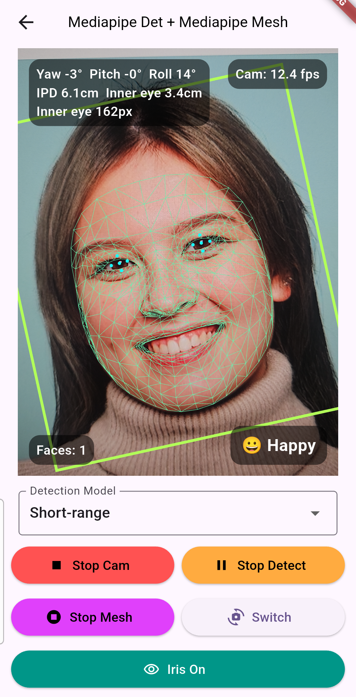

# mediapipe_face_mesh

Bundled files:
- TensorFlow Lite C runtime binaries for Android (`arm64-v8a`, `x86_64`) and iOS
- Model Source
  - https://github.com/google-ai-edge/mediapipe/blob/master/docs/solutions/models.md
    - face mesh
    - iris
    - short-range face detection
    - full-range dense and sparse face detection
  - https://storage.googleapis.com/mediapipe-models/face_landmarker/face_landmarker/float16/latest/face_landmarker.task
    - face_blendshapes

 

## Supported Platforms

- Android(arm64-v8a, x86_64)
- iOS
- Dart SDK: `>=3.8.1 <4.0.0`
- Android minSdk: `24`

## Install

```bash
flutter pub add mediapipe_face_mesh
```

## Usage

### Create Face Detector Processor

```dart
import 'package:mediapipe_face_mesh/mediapipe_face_mesh.dart';

final faceDetectorProcessor = await FaceDetectorProcessor.create(
  model: FaceDetectionModel.fullRange,
  delegate: FaceMeshDelegate.xnnpack,
  maxResults: 1,
);
```
`FaceDetectionModel` selects the bundled detector model:
`shortRange` is the default short-range BlazeFace model, `fullRange` is the
dense full-range model, and `fullRangeSparse` is the sparse full-range model.

Optional ROI options (`roiScaleX`, `roiScaleY`, `roiShiftX`, `roiShiftY`)
control how the detected face box is expanded and shifted into
`expandedFaceRect` — the region the face mesh looks at. The defaults match
the official face mesh pipeline, and since the pipeline tracks the face after
the first detection (see [Landmark tracking](#landmark-tracking)), these
options apply only when a face is (re)acquired and can usually be left at
their defaults.

### Create Face Mesh Processor

```dart
import 'package:mediapipe_face_mesh/mediapipe_face_mesh.dart';

final faceMeshProcessor = await FaceMeshProcessor.create(
  delegate: FaceMeshDelegate.xnnpack,
  enableSmoothing: true,
  enableRoiTracking: true,
  enableIris: true, // default is false; true returns 478 landmarks with 10 iris points
);
```

When `enableIris` is enabled, Face Mesh runs an additional iris landmark pass
after the base 468-point face mesh result. The final result keeps the existing
Face Mesh index layout, updates the eye-region landmarks with more precise eye
contour coordinates, and appends 10 iris landmarks at indices `468..477`.

Delegate options:
- `FaceMeshDelegate.cpu` (default)
- `FaceMeshDelegate.xnnpack`
- `FaceMeshDelegate.gpuV2`

If the requested delegate is unavailable or cannot be created, the runtime
automatically falls back to CPU inference. To disable fallback and fail
initialization instead, set `allowDelegateFallback: false`.

Use `activeDelegate` to inspect the delegate selected after fallback. When
`enableIris` is enabled, `activeIrisDelegate` reports the delegate used for the
iris model.

### Input Formats

The package supports two image input types:

- `FaceMeshNv21Image`
  Use this for Android camera frames in NV21 layout.
- `FaceMeshImage`
  Use this for RGBA or BGRA buffers. This is used for iOS camera frames.

On Android, camera frame streams are commonly delivered as YUV420-family buffers
in layouts such as single-plane NV21, Y + interleaved VU, or YUV420 Y/U/V
planes. The package provides `FaceMeshNv21Image` helpers for converting these
layouts into the NV21 input expected by `processNv21(...)`. See the example
camera image adapter for usage.

### Stream Inference

Use stream inference when processing continuous camera frames. Stream processors
take a Stream of frames and return a Stream of results.

```dart
final pipeline = FaceMeshInferencePipeline(
  detector: faceDetectorProcessor,
  mesh: faceMeshProcessor,
);
final inferenceStreamProcessor = FaceMeshInferenceStreamProcessor(pipeline);
final frameController = StreamController<FaceMeshNv21Image>();
bool _isBusy = false;

inferenceStreamProcessor
    .processNv21(
      frameController.stream,
      runMeshResolver: (_) => _isMeshActive,
      rotationDegrees: rotationDegrees,
    )
    .listen(_handleInferenceResult, onError: onError);

void _handleInferenceResult(FaceMeshInferenceResult result) {
  _isBusy = false;
  // detectionResult is null on landmark-tracked frames (detector skipped).
  final FaceDetectionResult? detections = result.detectionResult;
  if (detections != null) {
    onDetections(detections);
  }
  onMeshResult(result.meshResult);
}

void onCameraFrame(FaceMeshNv21Image frame) {
  if (_isBusy) return;
  _isBusy = true;
  frameController.add(frame);
}
```

Use `runMesh: false` when an entire stream should run detector-only. Use
`runMeshResolver` when mesh execution should be decided per frame, such as a UI
toggle that can change while the stream is active.

For BGRA / RGBA input, use `process(...)` instead of `processNv21(...)`.

#### Landmark tracking

By default, `FaceMeshInferencePipeline` runs the detector only when it needs to
acquire or re-acquire a face. Once tracking starts, mesh inference uses an ROI
derived from the previous frame's landmarks, so tracked frames skip detection.
On those frames, `FaceMeshInferenceResult.detectionResult` is null and
`selectedRoi` contains the tracked ROI.

Pass `enableLandmarkTracking: false` to `FaceMeshInferencePipeline` to run the
detector on every frame. Landmark tracking also requires the mesh processor's
default `enableRoiTracking: true`.

`detectorRoi` and detector ROI scale/shift options apply only to acquisition
frames. When switching input sources, call `resetTracking()` so the next frame
re-acquires the face instead of reusing the previous stream's tracked ROI.

For multi-face behavior, see [Multi-Face Inference](#multi-face-inference).

### Single Inference

Use single-frame inference in one call without a stream processor.

```dart
final pipeline = FaceMeshInferencePipeline(
  detector: faceDetectorProcessor,
  mesh: faceMeshProcessor,
);

final result = pipeline.processNv21(
  nv21Image,
  rotationDegrees: rotationDegrees,
);

final meshResult = result.meshResult;
if (meshResult != null) {
  onResult(meshResult);
}
```

For detector-only, set `runMesh: false`.

```dart
final result = pipeline.processNv21(
  nv21Image,
  runMesh: false,
  rotationDegrees: rotationDegrees,
);
```

### Geometry and Measurements

`FaceMeshResult` includes helpers for 2D distances and estimated 3D face
geometry:

```dart
// 2D pixel distance between two landmarks
final pixelDistance = meshResult.distancePixels(33, 263);

// 3D geometry estimation (native call — one per frame is typical)
final geometry = meshResult.estimateGeometry();
// Pass actual camera FOV for more accurate centimeter estimates (default: 63°)                                                                                                                                                                                                                                   
// final geometry = meshResult.estimateGeometry(verticalFovDegrees: 72.0);

// Head pose: yaw (left/right), pitch (up/down), roll (tilt)
final pose = geometry.headPose;
// pose.yawDegrees, pose.pitchDegrees, pose.rollDegrees

// Single centimeter distance between two landmarks
final eyeDistanceCm = geometry.distanceCm(33, 263);

// Preset bundle — computes all measurements at once
// faceWidth        234 ↔ 454  cheek-to-cheek
// faceHeight        10 ↔ 152  forehead-to-chin
// eyeOuterDistance  33 ↔ 263  outer eye corners
// eyeInnerDistance 133 ↔ 362  inner eye corners                                                                                                                                                                                                                                                
// interpupillaryDistance 468 ↔ 473  pupils (iris only, else null)                                                                                                                                                                                                                                  
// mouthWidth        61 ↔ 291                                                                                                                                                                                                                                                                                     
// noseWidth         98 ↔ 327 
final measurements = geometry.measurements;
final faceWidthCm = measurements.faceWidth.valueCm;
```

Centimeter values are estimates based on the canonical face geometry model.
Scale accuracy depends on the virtual camera assumption (default vertical FOV
63°) and will vary by device.

To look up landmark indices visually, use https://cornpip.github.io/mediapipe_landmark_viewer/

### Face Blendshapes

Blendshapes are 52 ARKit-style expression coefficients (jaw open, eye blink,
smile, etc.) — useful for avatars, Animoji-style effects, AR filters, and
expression detection. They are optional: create a `FaceBlendshapesProcessor`
once (it loads the model), then run it on each `FaceMeshResult` to get the
coefficients. The mesh must be created with `enableIris: true`, since the model
reads the iris landmarks.

```dart
final blendshapesProcessor = await FaceBlendshapesProcessor.create(
  delegate: FaceMeshDelegate.xnnpack,
);
```

Call `process` on a `FaceMeshResult` to get the coefficients as a
`Map<FaceBlendshape, double>` with values in `[0, 1]`. It returns null when the
result has no landmarks (no face was present in the frame).

```dart
if (meshResult != null) {
  final blendshapes = blendshapesProcessor.process(meshResult);
  if (blendshapes != null) {
    final smile = (blendshapes[FaceBlendshape.mouthSmileLeft]! +
            blendshapes[FaceBlendshape.mouthSmileRight]!) /
        2;
    if (smile > 0.5) {
      // smiling
    }
  }
}
```

`process` throws an `ArgumentError` if the mesh was created without `enableIris`
(fewer than 478 landmarks). Use `activeDelegate` to inspect the delegate selected
after fallback. 

Call `close()` to release the `FaceBlendshapesProcessor` when you
no longer need it.

### Multi-Face Inference

Multi-face inference tracks each face across frames. Each tracked face runs mesh
inference on an ROI derived from its previous landmarks, and the detector runs
only while fewer than `maxMeshFaces` faces are tracked. Each face keeps a stable
`trackId` while it is tracked.

Use `maxResults` on the detector to control how many faces a detection pass can
return, and `maxMeshFaces` to bound how many faces are tracked simultaneously.

Create the mesh processor with `createForMultiFace(...)`, which disables native
single-ROI tracking and smoothing for multi-face use.

```dart
final faceMeshProcessor = await FaceMeshProcessor.createForMultiFace(
  delegate: FaceMeshDelegate.xnnpack,
  enableIris: true,
);
```

```dart
final faceDetectorProcessor = await FaceDetectorProcessor.create(
  delegate: FaceMeshDelegate.xnnpack,
  maxResults: 4,
);
final pipeline = FaceMeshInferencePipeline(
  detector: faceDetectorProcessor,
  mesh: faceMeshProcessor,
);
final inferenceStreamProcessor = FaceMeshInferenceStreamProcessor(pipeline);

inferenceStreamProcessor
    .processNv21MultiFace(
      frameController.stream,
      maxMeshFaces: 2,
      runMeshResolver: (_) => _isMeshActive,
      rotationDegrees: rotationDegrees,
    )
    .listen(_handleMultiInferenceResult, onError: onError);

void _handleMultiInferenceResult(FaceMeshMultiInferenceResult result) {
  // detectionResult is null while all face slots are served by tracking.
  final FaceDetectionResult? detections = result.detectionResult;
  if (detections != null) {
    onDetections(detections);
  }
  for (final TrackedFaceMesh face in result.faces) {
    onFaceMesh(face.trackId, face.mesh); // trackId is stable across frames
  }
}
```

For BGRA / RGBA input, use `processMultiFace(...)` instead of
`processNv21MultiFace(...)`.

For single-frame multi-face inference, call the pipeline directly.

```dart
final FaceMeshMultiInferenceResult result = pipeline.processNv21MultiFace(
  nv21Image,
  maxMeshFaces: 4,
  rotationDegrees: rotationDegrees,
);

final List<TrackedFaceMesh> faces = result.faces;
```

### Close Resource

Explicitly calling close() when the processors are no longer needed is recommended.

```dart
faceDetectorProcessor.close();
faceMeshProcessor.close();
```

## Example app

The example app in `example/` uses the bundled MediaPipe face detector with
MediaPipe Face Mesh.

If you already use another face detector, pass its face box to
`FaceMeshProcessor.process(...)` or `processNv21(...)` as a `FaceMeshBox` or
`NormalizedRect`. For an older ML Kit detector integration example, see the
[v1.10.1 ML Kit example](https://github.com/cornpip/mediapipe_face_mesh/blob/v1.10.1/example/lib/page/mediapipe_face/mediapipe_face_page_mlkit.dart).
