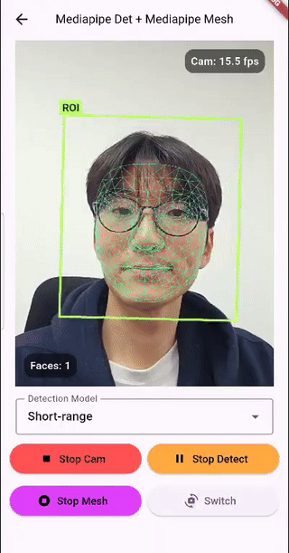

# mediapipe_face_mesh

Bundled files:
- TensorFlow Lite C runtime binaries for Android (`arm64-v8a`, `x86_64`) and iOS
- [MediaPipe TFLite model](https://github.com/google-ai-edge/mediapipe/blob/master/docs/solutions/models.md)
  - face mesh
  - iris
  - short-range face detection
  - full-range dense and sparse face detection

 

## Supported Platforms

- Android(arm64-v8a, x86_64)
- iOS
- Dart SDK: `>=3.8.1 <4.0.0`
- Android minSdk: `24`

## Install

```bash
flutter pub add mediapipe_face_mesh
```

## Usage

### Create Face Detector Processor

```dart
import 'package:mediapipe_face_mesh/mediapipe_face_mesh.dart';

final faceDetectorProcessor = await FaceDetectorProcessor.create(
  model: FaceDetectionModel.fullRange,
  delegate: FaceMeshDelegate.xnnpack,
  maxResults: 1,
  roiScaleY: 1.7,
  roiShiftY: -0.2,
);
```
`FaceDetectionModel` selects the bundled detector model:
`shortRange` is the default short-range BlazeFace model, `fullRange` is the
dense full-range model, and `fullRangeSparse` is the sparse full-range model.

ROI options adjust the detector-produced `expandedFaceRect`, which is passed to
face mesh while keeping the original frame unchanged.

### Create Face Mesh Processor

```dart
import 'package:mediapipe_face_mesh/mediapipe_face_mesh.dart';

final faceMeshProcessor = await FaceMeshProcessor.create(
  delegate: FaceMeshDelegate.xnnpack,
  enableSmoothing: true,
  enableRoiTracking: true,
  enableIris: true, // default is false; true returns 478 landmarks with 10 iris points
);
```

When `enableIris` is enabled, Face Mesh runs an additional iris landmark pass
after the base 468-point face mesh result. The final result keeps the existing
Face Mesh index layout, updates the eye-region landmarks with more precise eye
contour coordinates, and appends 10 iris landmarks at indices `468..477`.

Delegate options:
- `FaceMeshDelegate.cpu` (default)
- `FaceMeshDelegate.xnnpack`
- `FaceMeshDelegate.gpuV2`

If the requested delegate is unavailable or cannot be created, the runtime
automatically falls back to CPU inference. To disable fallback and fail
initialization instead, set `allowDelegateFallback: false`.

Use `activeDelegate` to inspect the delegate selected after fallback. When
`enableIris` is enabled, `activeIrisDelegate` reports the delegate used for the
iris model.

### Input Formats

The package supports two image input types:

- `FaceMeshNv21Image`
  Use this for Android camera frames in NV21 layout.
- `FaceMeshImage`
  Use this for RGBA or BGRA buffers. This is used for iOS camera frames.

On Android, camera frame streams are commonly delivered as YUV420-family buffers
in layouts such as single-plane NV21, Y + interleaved VU, or YUV420 Y/U/V
planes. The package provides `FaceMeshNv21Image` helpers for converting these
layouts into the NV21 input expected by `processNv21(...)`. See the example
camera image adapter for usage.

### Stream Inference

Use stream inference when processing continuous camera frames. Stream processors
take a Stream of frames and return a Stream of results.

```dart
final pipeline = FaceMeshInferencePipeline(
  detector: faceDetectorProcessor,
  mesh: faceMeshProcessor,
);
final inferenceStreamProcessor = FaceMeshInferenceStreamProcessor(pipeline);
final frameController = StreamController<FaceMeshNv21Image>();
bool _isBusy = false;

inferenceStreamProcessor
    .processNv21(
      frameController.stream,
      runMeshResolver: (_) => _isMeshActive,
      rotationDegrees: rotationDegrees,
    )
    .listen(_handleInferenceResult, onError: onError);

void _handleInferenceResult(FaceMeshInferenceResult result) {
  _isBusy = false;
  onDetections(result.detectionResult);
  onMeshResult(result.meshResult);
}

void onCameraFrame(FaceMeshNv21Image frame) {
  if (_isBusy) return;
  _isBusy = true;
  frameController.add(frame);
}
```

Use `runMesh: false` when an entire stream should run detector-only. Use
`runMeshResolver` when mesh execution should be decided per frame, such as a UI
toggle that can change while the stream is active.

For BGRA / RGBA input, use `process(...)` instead of `processNv21(...)`.

### Single Inference

Use single-frame inference in one call without a stream processor.

```dart
final pipeline = FaceMeshInferencePipeline(
  detector: faceDetectorProcessor,
  mesh: faceMeshProcessor,
);

final result = pipeline.processNv21(
  nv21Image,
  rotationDegrees: rotationDegrees,
);

final meshResult = result.meshResult;
if (meshResult != null) {
  onResult(meshResult);
}
```

For detector-only, set `runMesh: false`.

```dart
final result = pipeline.processNv21(
  nv21Image,
  runMesh: false,
  rotationDegrees: rotationDegrees,
);
```

### Geometry and Measurements

`FaceMeshResult` includes helpers for 2D distances and estimated 3D face
geometry:

```dart
// 2D pixel distance between two landmarks
final pixelDistance = meshResult.distancePixels(33, 263);

// 3D geometry estimation (native call — one per frame is typical)
final geometry = meshResult.estimateGeometry();
// Pass actual camera FOV for more accurate centimeter estimates (default: 63°)                                                                                                                                                                                                                                   
// final geometry = meshResult.estimateGeometry(verticalFovDegrees: 72.0);

// Head pose: yaw (left/right), pitch (up/down), roll (tilt)
final pose = geometry.headPose;
// pose.yawDegrees, pose.pitchDegrees, pose.rollDegrees

// Single centimeter distance between two landmarks
final eyeDistanceCm = geometry.distanceCm(33, 263);

// Preset bundle — computes all measurements at once
// faceWidth        234 ↔ 454  cheek-to-cheek
// faceHeight        10 ↔ 152  forehead-to-chin
// eyeOuterDistance  33 ↔ 263  outer eye corners
// eyeInnerDistance 133 ↔ 362  inner eye corners                                                                                                                                                                                                                                                
// interpupillaryDistance 468 ↔ 473  pupils (iris only, else null)                                                                                                                                                                                                                                  
// mouthWidth        61 ↔ 291                                                                                                                                                                                                                                                                                     
// noseWidth         98 ↔ 327 
final measurements = geometry.measurements;
final faceWidthCm = measurements.faceWidth.valueCm;
```

Centimeter values are estimates based on the canonical face geometry model.
Scale accuracy depends on the virtual camera assumption (default vertical FOV
63°) and will vary by device.

To look up landmark indices visually, use https://cornpip.github.io/mediapipe_landmark_viewer/

### Multi-Face Inference

Multi-face mesh inference runs face detection once, then runs mesh inference for
each selected detector ROI. Use `maxResults` on the detector to control how many
faces are detected, and `maxMeshFaces` on the multi-face mesh call to control
how many mesh inferences are run.

Create the mesh processor with tracking and smoothing disabled so state from one
face ROI does not affect the next face ROI.

`createForMultiFace(...)` is a convenience factory equivalent to
`FaceMeshProcessor.create(..., enableSmoothing: false, enableRoiTracking: false)`.

```dart
final faceMeshProcessor = await FaceMeshProcessor.createForMultiFace(
  delegate: FaceMeshDelegate.xnnpack,
  enableIris: true,
);
```

```dart
final faceDetectorProcessor = await FaceDetectorProcessor.create(
  delegate: FaceMeshDelegate.xnnpack,
  maxResults: 4,
);
final pipeline = FaceMeshInferencePipeline(
  detector: faceDetectorProcessor,
  mesh: faceMeshProcessor,
);
final inferenceStreamProcessor = FaceMeshInferenceStreamProcessor(pipeline);

inferenceStreamProcessor
    .processNv21MultiFace(
      frameController.stream,
      maxMeshFaces: 2,
      runMeshResolver: (_) => _isMeshActive,
      rotationDegrees: rotationDegrees,
    )
    .listen(_handleMultiInferenceResult, onError: onError);

void _handleMultiInferenceResult(FaceMeshMultiInferenceResult result) {
  onDetections(result.detectionResult);
  onMeshResults(result.meshResults);
}
```

For BGRA / RGBA input, use `processMultiFace(...)` instead of
`processNv21MultiFace(...)`.

For single-frame multi-face inference, call the pipeline directly.

```dart
final FaceMeshMultiInferenceResult result = pipeline.processNv21MultiFace(
  nv21Image,
  maxMeshFaces: 4,
  rotationDegrees: rotationDegrees,
);

final FaceDetectionResult detections = result.detectionResult;
final List<FaceMeshResult> meshResults = result.meshResults;
```

### Close Resource

Explicitly calling close() when the processors are no longer needed is recommended.

```dart
faceDetectorProcessor.close();
faceMeshProcessor.close();
```

### Notes

The examples in this README use the v1.6.0+ unified inference API.

`FaceMeshInferenceStreamProcessor` emits one combined result after detector and
mesh inference complete, so detection boxes and mesh landmarks are updated
together.

If you need detector boxes to update independently from slower mesh inference,
use `FaceDetectorStreamProcessor` and `FaceMeshStreamProcessor` separately; see
the [v1.5.0](https://github.com/cornpip/mediapipe_face_mesh/tree/v1.5.0) README and example app
for a two-stage stream pattern.

These separated stream processors are still available in v1.6.0 and later.

## Example app

The example app in `example/` provides two flows:

A. MediaPipe Face Detector + MediaPipe Face Mesh  
B. ML Kit Face Detector + MediaPipe Face Mesh

`B` depends on the `google_mlkit_face_detection` package for face detection.

