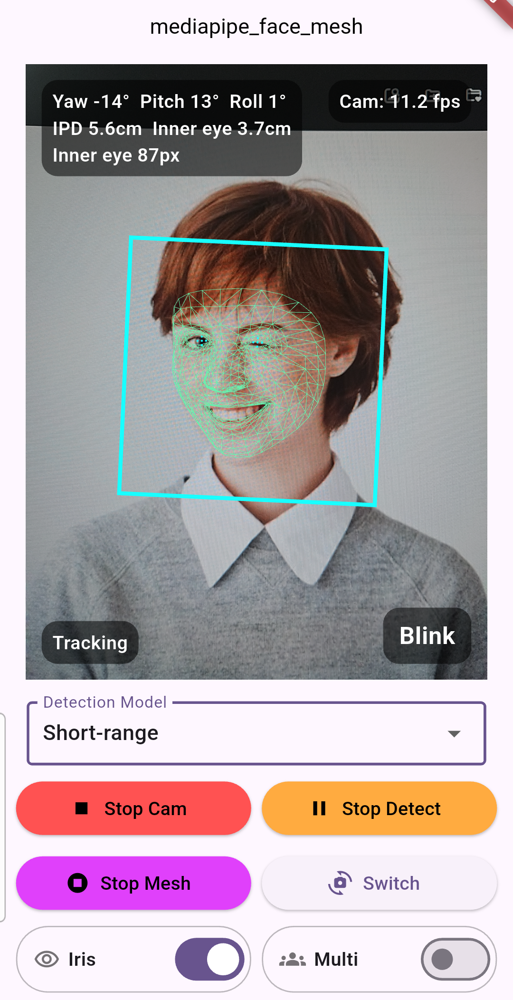
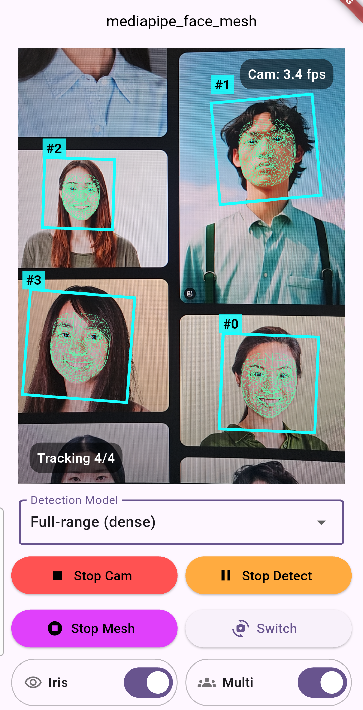

# mediapipe_face_mesh

Bundled files:
- TensorFlow Lite C runtime binaries for Android (`arm64-v8a`, `x86_64`), iOS,
  and Windows (`x64`)
- Model Source
  - https://github.com/google-ai-edge/mediapipe/blob/master/docs/solutions/models.md
  - https://storage.googleapis.com/mediapipe-models/face_landmarker/face_landmarker/float16/latest/face_landmarker.task

 

## Supported Platforms

- Android(arm64-v8a, x86_64)
- iOS
- Windows(x64) — attention mesh not supported yet (support planned)
- Dart SDK: `>=3.8.1 <4.0.0`
- Android minSdk: `24`

## Install

```bash
flutter pub add mediapipe_face_mesh
```

## Usage

### Create Face Detector Processor

```dart
import 'package:mediapipe_face_mesh/mediapipe_face_mesh.dart';

final faceDetectorProcessor = await FaceDetectorProcessor.create(
  model: FaceDetectionModel.fullRange,
  delegate: FaceMeshDelegate.xnnpack,
  maxResults: 1,
);
```
`FaceDetectionModel` selects the bundled detector model:
`shortRange` is the default short-range BlazeFace model, `fullRange` is the
dense full-range model, and `fullRangeSparse` is the sparse full-range model.

### Create Face Mesh Processor

```dart
import 'package:mediapipe_face_mesh/mediapipe_face_mesh.dart';

final faceMeshProcessor = await FaceMeshProcessor.create(
  delegate: FaceMeshDelegate.xnnpack,
  enableSmoothing: true,
  enableRoiTracking: true,
  enableIris: true, // default is false; true returns 478 landmarks with 10 iris points
);
```

When `enableIris` is enabled, Face Mesh runs an additional iris landmark pass
after the base 468-point face mesh result. The final result keeps the existing
Face Mesh index layout, updates the eye-region landmarks with more precise eye
contour coordinates, and appends 10 iris landmarks at indices `468..477`.

#### Attention mesh

`enableAttentionMesh` swaps the base mesh model for the unified
`face_landmark_with_attention` model, which refines the lips, eyes, and irises in
a single inference and is more accurate around those regions than the base mesh
(plus iris pass).

```dart
final faceMeshProcessor = await FaceMeshProcessor.create(
  delegate: FaceMeshDelegate.xnnpack,
  enableAttentionMesh: true, // default is false
);
```

It returns the same 478-landmark layout as `enableIris`, so anything that
consumes those landmarks keeps working — in one inference instead of the base
mesh plus a separate iris pass. If you set both, `enableIris` is ignored.

Windows — `create` throws an `UnsupportedError`. Use `enableIris` there
instead. Windows support for the attention model is planned.

Delegate options:
- `FaceMeshDelegate.cpu` (default)
- `FaceMeshDelegate.xnnpack`
- `FaceMeshDelegate.gpuV2`

If the requested delegate is unavailable or cannot be created, the runtime
automatically falls back to CPU inference. To disable fallback and fail
initialization instead, set `allowDelegateFallback: false`.

Use `activeDelegate` to inspect the delegate selected after fallback. When
`enableIris` is enabled, `activeIrisDelegate` reports the delegate used for the
iris model.

### Input Formats

The package supports two image input types:

- `FaceMeshNv21Image`
  Use this for Android camera frames in NV21 layout.
- `FaceMeshImage`
  Use this for RGBA or BGRA buffers — iOS camera frames, desktop/USB (UVC)
  camera frames, or any decoded image.

On Android, camera frame streams are commonly delivered as YUV420-family buffers
in layouts such as single-plane NV21, Y + interleaved VU, or YUV420 Y/U/V
planes. The package provides `FaceMeshNv21Image` helpers for converting these
layouts into the NV21 input expected by `processNv21(...)`. See the example
camera image adapter for usage.

### Stream Inference

Use stream inference when processing continuous camera frames. Stream processors
take a Stream of frames and return a Stream of results.

```dart
final pipeline = FaceMeshInferencePipeline(
  detector: faceDetectorProcessor,
  mesh: faceMeshProcessor,
);
final inferenceStreamProcessor = FaceMeshInferenceStreamProcessor(pipeline);
final frameController = StreamController<FaceMeshNv21Image>();
bool _isBusy = false;
bool _isMeshActive = true; // e.g. driven by a UI toggle

inferenceStreamProcessor
    .processNv21(
      frameController.stream,
      runMeshResolver: (_) => _isMeshActive,
      rotationDegrees: rotationDegrees,
    )
    .listen(_handleInferenceResult, onError: onError);

void _handleInferenceResult(FaceMeshInferenceResult result) {
  _isBusy = false;
  // detectionResult is null on landmark-tracked frames (detector skipped).
  final FaceDetectionResult? detections = result.detectionResult;
  if (detections != null) {
    onDetections(detections);
  }
  onMeshResult(result.meshResult);
}

void onCameraFrame(FaceMeshNv21Image frame) {
  if (_isBusy) return;
  _isBusy = true;
  frameController.add(frame);
}
```

Use `runMesh: false` when an entire stream should run detector-only. Use
`runMeshResolver` when mesh execution should be decided per frame, such as a UI
toggle that can change while the stream is active.

`rotationDegrees` is fixed per subscription — when the camera rotation (or the
input source) changes, re-subscribe with the new value; see the example app
for a complete flow.

For BGRA / RGBA input, use `process(...)` instead of `processNv21(...)`.

#### Landmark tracking

By default, `FaceMeshInferencePipeline` runs the detector only to acquire or
re-acquire a face; tracked frames reuse an ROI derived from the previous
frame's landmarks and report `detectionResult` as null. When the face is lost
(mesh presence below `minTrackingConfidence`), the detector re-acquires it on
the next frame — `FaceMeshProcessor.isTracking` reports the current state.
Pass `enableLandmarkTracking: false` to run the detector on every frame, and
call `resetTracking()` when switching input sources so the next frame does not
reuse the previous stream's ROI.

For multi-face behavior, see [Multi-Face Inference](#multi-face-inference).

#### Landmark smoothing

Landmarks are re-inferred every frame, so they jitter slightly even on a
still face. Pass `landmarkSmoothing` to smooth output landmarks across
frames with a OneEuro filter, matching the official MediaPipe FaceLandmarker
stream-mode behavior:

```dart
final pipeline = FaceMeshInferencePipeline(
  detector: faceDetectorProcessor,
  mesh: faceMeshProcessor,
  landmarkSmoothing: const LandmarkSmoothingOptions(), // official defaults
);
```

The filter adapts to motion: a still face is smoothed strongly while fast
head movement passes through with almost no lag. Enabling it changes only
the returned landmarks — detection and tracking behave exactly as before.
In the multi-face flow each tracked face is smoothed independently.

Frame timestamps default to an internal clock; pass `timestamp` to the
process methods when replaying recorded video. Tune the
stillness-vs-responsiveness trade-off with `LandmarkSmoothingOptions`
(`minCutoff`, `beta`), or use `FaceLandmarkSmoother` directly when driving
`FaceMeshProcessor` without the pipeline.

### Single Inference

Use single-frame inference in one call without a stream processor.

```dart
final pipeline = FaceMeshInferencePipeline(
  detector: faceDetectorProcessor,
  mesh: faceMeshProcessor,
);

final result = pipeline.processNv21(
  nv21Image,
  rotationDegrees: rotationDegrees,
);

final meshResult = result.meshResult;
if (meshResult != null) {
  onResult(meshResult);
}
```

For detector-only inference, pass `runMesh: false`.

### Geometry and Measurements

`FaceMeshResult` includes helpers for 2D distances and estimated 3D face
geometry:

```dart
// 2D pixel distance between two landmarks
final pixelDistance = meshResult.distancePixels(33, 263);

// 3D geometry estimation (native call — one per frame is typical)
final geometry = meshResult.estimateGeometry();
// Pass actual camera FOV for more accurate centimeter estimates (default: 63°)
// final geometry = meshResult.estimateGeometry(verticalFovDegrees: 72.0);

// Head pose: yaw (left/right), pitch (up/down), roll (tilt)
final pose = geometry.headPose;
// pose.yawDegrees, pose.pitchDegrees, pose.rollDegrees

// Single centimeter distance between two landmarks
final eyeDistanceCm = geometry.distanceCm(33, 263);

// Preset bundle — computes all measurements at once
// faceWidth        234 ↔ 454  cheek-to-cheek
// faceHeight        10 ↔ 152  forehead-to-chin
// eyeOuterDistance  33 ↔ 263  outer eye corners
// eyeInnerDistance 133 ↔ 362  inner eye corners
// interpupillaryDistance 468 ↔ 473  pupils (iris only, else null)
// mouthWidth        61 ↔ 291
// noseWidth         98 ↔ 327 
final measurements = geometry.measurements;
final faceWidthCm = measurements.faceWidth.valueCm;
```

Centimeter values are estimates based on the canonical face geometry model.
Scale accuracy depends on the virtual camera assumption (default vertical FOV
63°) and will vary by device.

To look up landmark indices visually, use https://cornpip.github.io/mediapipe_landmark_viewer/

### Face Blendshapes

Blendshapes are 52 ARKit-style expression coefficients (jaw open, eye blink,
smile, etc.) — useful for avatars, AR filters, and expression detection.
Requires a mesh created with `enableIris: true` or `enableAttentionMesh: true`,
since the model reads the iris landmarks.

```dart
final blendshapesProcessor = await FaceBlendshapesProcessor.create(
  delegate: FaceMeshDelegate.xnnpack,
);

// Map<FaceBlendshape, double> with values in [0, 1];
// null when the frame had no face.
final blendshapes = blendshapesProcessor.process(meshResult);
if (blendshapes != null) {
  final smile = (blendshapes[FaceBlendshape.mouthSmileLeft]! +
          blendshapes[FaceBlendshape.mouthSmileRight]!) /
      2;
  if (smile > 0.5) {
    // smiling
  }
}
```

Call `close()` when the processor is no longer needed.

### Multi-Face Inference

Multi-face inference tracks each face across frames with a stable `trackId`;
the detector runs only while fewer than `maxMeshFaces` faces are tracked, and
each frame's mesh inferences run through one batched native call regardless of
face count. Create the mesh processor with `createForMultiFace(...)`, which
disables native single-ROI tracking and smoothing for multi-face use.

```dart
final faceMeshProcessor = await FaceMeshProcessor.createForMultiFace(
  delegate: FaceMeshDelegate.xnnpack,
  enableIris: true,
);
final faceDetectorProcessor = await FaceDetectorProcessor.create(
  delegate: FaceMeshDelegate.xnnpack,
  maxResults: 4,
);
final pipeline = FaceMeshInferencePipeline(
  detector: faceDetectorProcessor,
  mesh: faceMeshProcessor,
);
final inferenceStreamProcessor = FaceMeshInferenceStreamProcessor(pipeline);

inferenceStreamProcessor
    .processNv21MultiFace(
      frameController.stream,
      maxMeshFaces: 2,
      runMeshResolver: (_) => _isMeshActive,
      rotationDegrees: rotationDegrees,
    )
    .listen(_handleMultiInferenceResult, onError: onError);

void _handleMultiInferenceResult(FaceMeshMultiInferenceResult result) {
  // detectionResult is null while all face slots are served by tracking.
  final FaceDetectionResult? detections = result.detectionResult;
  if (detections != null) {
    onDetections(detections);
  }
  for (final TrackedFaceMesh face in result.faces) {
    onFaceMesh(face.trackId, face.mesh); // trackId is stable across frames
  }
}
```

For BGRA / RGBA input, use `processMultiFace(...)` instead of
`processNv21MultiFace(...)`. For single-frame multi-face inference, call
`pipeline.processNv21MultiFace(...)` directly.

### Using an External Face Detector

The bundled detector is optional. If you already use another face detector
(e.g. ML Kit), pass its face box to `FaceMeshProcessor.process(...)` or
`processNv21(...)` as a `FaceMeshBox` or `NormalizedRect` and skip
`FaceDetectorProcessor` entirely.

### Close Resource

Explicitly calling close() when the processors are no longer needed is recommended.

```dart
faceDetectorProcessor.close();
faceMeshProcessor.close();
```

## Example app

A demo app lives in the `example/` directory at the root of this
repository.
